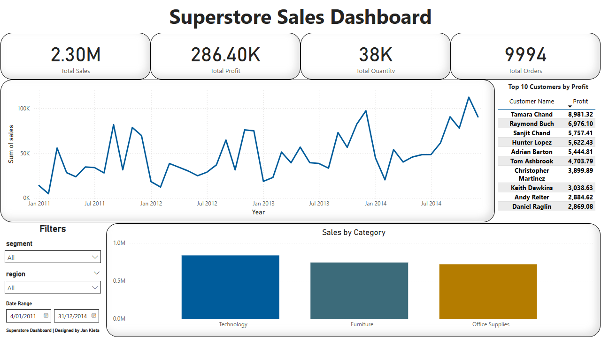

# superstore-sales-project
End-to-end sales and customer analytics using SQL, Python and Power BI.

# 📈 Superstore Sales Dashboard Project

Welcome to my full-stack data analytics project!  
In this project, I built a complete **Sales Dashboard** solution using **PostgreSQL**, **Python**, and **Power BI**.

## 🚀 Project Overview

The goal of this project was to simulate a real-world business case: analyzing and visualizing sales data for a global retail company.

I started from raw CSV data and ended with a professional dashboard ready for decision-makers.

✅ Data Engineering (PostgreSQL)  
✅ Data Analysis (SQL, Python)  
✅ Business Intelligence (Power BI)

## 🛠️ Tools & Technologies Used

- **PostgreSQL** (Database and Data Modeling)
- **SQLAlchemy & psycopg2** (Python to SQL Connection)
- **Pandas** (Data Analysis in Python)
- **Power BI Desktop** (Data Visualization)
- **Git & GitHub** (Version Control and Portfolio)

## 🧠 Project Steps

1. **Data Loading**  
   - Loaded raw sales data (CSV) into PostgreSQL database.

2. **Data Modeling**  
   - Created a **Star Schema**: Fact and Dimension tables.
   - Normalized the database for better analytics.

3. **Data Analysis with Python**  
   - Connected Python to PostgreSQL using SQLAlchemy.
   - Ran analytical queries and prepared clean exports for visualization.

4. **Dashboard Design (Power BI)**  
   - Designed a clean, modern dashboard using a custom theme.
   - Included KPIs, Trends, Category Breakdown, Top Customers, and Filters.

5. **Project Management**  
   - Organized project files with clear folder structure (`/data`, `/python`, `/powerbi`).

## 🖼️ Final Dashboard Preview

## 📁 Project Structure
superstore-sales-project/
├── data/
│   ├── fact_sales_export.csv
│   ├── superstore_clean.csv
│   └── Superstore.csv
├── powerbi/
│   ├── SuperstoreDashboard.pbix
│   └── superstore_theme.json
├── sql/
│   ├── connect_db.sql
│   ├── copy_data_from_1_to_5.sql
│   ├── create_5_tables.sql
│   ├── create_table.sql
│   ├── monthly_sales_trend.sql
│   ├── sales_by_region_and_ship.sql
│   ├── top_5_customers_by_profit.sql
│   └── total_sales_by_category.sql
├── python/
│   ├── analysis.py
│   ├── clean_csv.py
│   └── connect_db.py
├── matplotlib/
│   ├── monthly_sales_trend_chart.png
│   ├── sales_by_category_chart.png
│   └── top_10_customers_by_profit.png
├── dashboard_screenshot.png
├── database_project.pdf
├── README.md
├── req_install_script.bash
└── requirements.txt

## 📚 Skills Demonstrated

- Data Cleaning and Preparation
- SQL Data Modeling (Star Schema Design)
- Database to Python Connectivity
- Data Visualization Best Practices
- Dashboard UI/UX Design
- GitHub Portfolio Presentation

## ✨ About Me

👋 Hi, I'm Jan Kleta, an aspiring Data Analyst passionate about turning data into actionable insights.  
I'm continuously building real-world projects to improve my SQL, Python, and Power BI skills.

Feel free to connect with me on [LinkedIn](https://www.linkedin.com/in/jan-kleta-98b701144)!

# 🚀 Thank you for viewing my project!